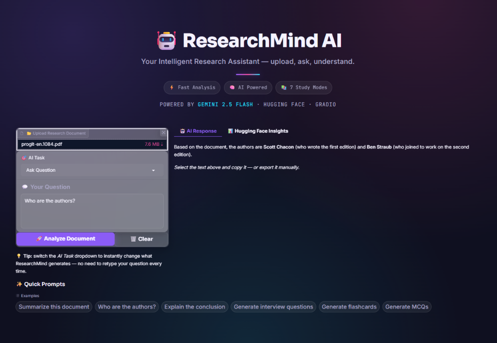

# ResearchMind AI Assistant

An intelligent research assistant powered by Google Gemini, Hugging Face (for NER and Zero-Shot Classification), and Gradio for the user interface.


```
  🌎🫰Here is the Demo video 

```

[Click Here To Watch](https://drive.google.com/file/d/1qh39v1zZ_JShLUVy940k_1BN_nSIfMBD/view?usp=drive_link)


## Features

- Upload PDF documents.
- Ask questions about the document.
- Summarize documents.
- Explain documents like to a 10-year-old.
- Generate quiz questions, flashcards, interview questions, and executive summaries.
- Extract named entities (People, Organizations, Locations).
- Classify document type.

## Setup

1.  **Clone the repository:**
    ```bash
    git clone https://github.com/yourusername/my_research_assistant.git
    cd my_research_assistant
    ```

2.  **Create a virtual environment (recommended):**
    ```bash
    python -m venv venv
    source venv/bin/activate  # On Windows, use `venv\Scripts\activate`
    ```

3.  **Install dependencies:**
    ```bash
    pip install -r requirements.txt
    ```

4.  **Get your Gemini API Key:**
    - Go to Google AI Studio and create an API key.
    - Set it as an environment variable named `GEMINI_API_KEY` or replace `userdata.get("GEMINI_API_KEY")` in `utils/gemini_utils.py` with your key directly (not recommended for security).

    ```bash
    export GEMINI_API_KEY="your_gemini_api_key_here"
    ```

## Usage

To run the Gradio application:

```bash
python gradio_app.py
This will launch the Gradio interface in your browser.


---

### `requirements.txt`
